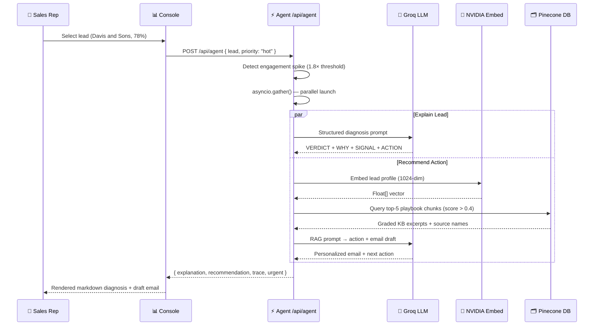

<div align="center">

<h1>

```
██╗     ███████╗ █████╗ ██████╗ ██╗ ██████╗ 
██║     ██╔════╝██╔══██╗██╔══██╗██║██╔═══██╗
██║     █████╗  ███████║██║  ██║██║██║   ██║
██║     ██╔══╝  ██╔══██║██║  ██║██║██║▄▄ ██║
███████╗███████╗██║  ██║██████╔╝██║╚██████╔╝
╚══════╝╚══════╝╚═╝  ╚═╝╚═════╝ ╚═╝ ╚══▀▀═╝
```

</h1>

<h2>AI Sales Lead Intelligence Platform</h2>

**ML-Scored · Autonomous Agent-Driven · RAG-Grounded · Full-Stack**

[](https://nextjs.org)
[](https://fastapi.tiangolo.com)
[](https://tailwindcss.com)
[](https://groq.com)
[](https://build.nvidia.com)
[](https://pinecone.io)
[](https://xgboost.readthedocs.io)
[](LICENSE)

<br>

> **LeadIQ** is an enterprise-grade, full-stack B2B sales intelligence platform that qualifies leads autonomously.  
> It fuses a **custom XGBoost classification model**, a **parallel autonomous LLM agent**, and a **Pinecone RAG pipeline**  
> to deliver real-time lead diagnostics, playbook-grounded outreach drafts, and coaching — all in one unified console.

<br>

[🎯 Features](#-key-features) · [🏗️ Architecture](#️-system-architecture) · [🧠 ML Engine](#-ml-scoring-engine) · [🤖 Agent](#-autonomous-sales-operations-agent) · [🗂️ RAG Pipeline](#️-rag-pipeline) · [🚀 Quick Start](#-quick-start--setup) · [👤 Developer](#-developer-profile)

</div>

---

<div align="center">

## 📑 Table of Contents

| Core Platform | Intelligence Engine | Developer Resources |
|:---:|:---:|:---:|
| [🎯 Key Features](#-key-features) | [🏗️ System Architecture](#️-system-architecture) | [💻 Quick Start](#-quick-start--setup) |
| [🆚 Why LeadIQ?](#-why-leadiq) | [🧠 ML Scoring Engine](#-ml-scoring-engine) | [⚙️ Configuration](#️-configuration) |
| [💬 Request Walkthrough](#-lead-qualification-walkthrough) | [🤖 Autonomous Agent](#-autonomous-sales-operations-agent) | [🗺️ Roadmap](#️-roadmap) |
| [📁 Project Structure](#-project-structure) | [🗂️ RAG Pipeline](#️-rag-pipeline) | [👤 Developer Profile](#-developer-profile) |

</div>

---

## 🎯 Key Features

<div align="center">

| Feature | Description |
|:--------|:------------|
| 🔐 **Company-Scoped Authentication** | Two-step login scopes all pipeline data, agents, and RAG results to the authenticated company session |
| ⚡ **Parallel Fast-Path Agent** | `asyncio.gather()` fires lead diagnostics & playbook recommendation concurrently — **~20s → ~5s** |
| 🧠 **XGBoost ML Classification** | Three-model tournament (Logistic Regression, Random Forest, XGBoost) selects the F1-champion automatically |
| 📊 **Top-3 Contributing Factors** | Per-lead human-readable factors (`Demo Requested`, `High Visits`, `Referral Source`) extracted by feature importance intersection |
| 📚 **NVIDIA NIM RAG Playbooks** | Query embedding via `nvidia/nv-embedqa-e5-v5` (1024-dim) scores playbook chunks from Pinecone for grounded answers |
| 🔥 **Engagement Spike Detector** | Flags leads whose 7-day visits exceed their historical baseline by **1.8×** as imminent buying signals |
| 🔇 **Cold Lead Auto-Muter** | Instantly logs `no_action_needed` for cold leads with zero engagement, saving rep time |
| ✉️ **Personalized Email Drafts** | RAG-grounded outreach emails personalized by industry, visit history, and conversion score — never a generic template |
| 💬 **Hybrid RAG Sales Coach** | Context-aware chat assistant grounded in case studies and FAQs, with general B2B coaching fallback |
| 🔁 **ML Feedback Retraining** | Outcome feedback logged to `data/feedback.csv` for offline model retraining on real sales data |

</div>

---

<div align="center">

## 🆚 Why LeadIQ?


### Manual Qualification vs. LeadIQ Intelligence

| Capability | Manual CRM Process | **LeadIQ Platform** |
|:-----------|:-----------------:|:-------------------:|
| **Lead Scoring** | Subjective rep intuition | 🧠 XGBoost ML classifier (F1-optimized, 3-model tournament) |
| **Qualification Speed** | Hours per batch review | ⚡ Parallel async agent (~5 seconds per lead) |
| **Outreach Drafts** | Generic copy-paste templates | ✉️ RAG-grounded, personalized by industry & visit history |
| **Cold Leads** | Manual status updates required | 🔇 Auto-muted with `no_action_needed` logging |
| **Engagement Signals** | Manual inbox checking | 🔥 Automated 1.8× spike detection per lead |
| **Playbook Access** | Searching shared folders | 📚 Vector similarity search (Pinecone, 1024-dim NVIDIA embeds) |
| **Audit Transparency** | No reasoning trail | 🔍 Full tool-by-tool execution trace per decision |
| **Rep Coaching** | Manager 1-on-1s | 💬 Instant hybrid RAG chatbot grounded in case studies |
| **Company Isolation** | Shared spreadsheets | 🔐 Session-scoped authentication per company |
| **Model Learning** | Static — never improves | 🔁 Feedback-driven offline retraining pipeline |

### 🏆 Key Differentiators

<table>
<tr>
<td align="center" width="25%">
<br>
<b>ML-Powered Scoring</b><br>Trained on 1,500 synthetic leads across 35 companies with realistic conversion correlations
</td>
<td align="center" width="25%">
<br>
<b>Parallel Execution</b><br>Diagnosis and playbook lookup fire simultaneously via Python <code>asyncio.gather()</code>
</td>
<td align="center" width="25%">
<br>
<b>Precision RAG</b><br>1024-dimensional NVIDIA NIM embeddings retrieve the most relevant policy chunks with high fidelity
</td>
<td align="center" width="25%">
<br>
<b>Ultra-Fast LLM</b><br>Groq inference at ~800 tokens/sec for real-time structured diagnostics and email drafts
</td>
</tr>
</table>

</div>

---

<div align="center">

## 🏗️ System Architecture

```mermaid
graph TB
    A[👤 Sales Rep Login] -->|Company + Access Code| B[🔐 Session Scoping Layer]
    B --> C[📊 Lead Intelligence Console - Next.js 14]
    
    C -->|Select Lead| D[⚡ Autonomous Agent /api/agent]
    D -->|asyncio.gather| E1[🧠 Explain Lead\nGroq LLaMA-3.3-70B]
    D -->|asyncio.gather| E2[📚 Recommend Action\nNVIDIA Embed → Pinecone → Groq]
    
    E2 --> F[🗂️ Pinecone Vector DB\n1024-dim NVIDIA Embeddings]
    F --> E2
    
    D -->|cold lead| G[🔇 Auto-Muter\nno_action_needed]
    D -->|hot + spike| H[🔥 Engagement Spike\nUrgency Flag]
    
    C -->|Chat| I[💬 RAG Sales Coach\nEmbeds → Pinecone → Groq]
    C -->|Upload CSV| J[📁 Company Register\nbest_model.pkl → Score]
    J -->|Append| K[(🗄️ scored_leads.csv\n1,500 Leads · 35 Companies)]
    
    C -->|Log Outcome| L[📝 Feedback Logger\ndata/feedback.csv]
    L -->|Retrain| M[🐍 Python ML Pipeline\nLR · RF · XGBoost Tournament]
    M -->|Champion| K

    style A fill:#0088CC
    style B fill:#DC2626
    style C fill:#4A90E2
    style D fill:#16A34A
    style E1 fill:#7C3AED
    style E2 fill:#7C3AED
    style F fill:#000000
    style M fill:#F59E0B
```


</div>



---

<div align="center">

## 🧠 ML Scoring Engine


*The pipeline generates, trains, and selects the best classifier automatically*

</div>

### 🔬 The Training Pipeline

<div align="center">

```
                     🐍 ml/generate_and_train.py
                              │
         ┌────────────────────┼────────────────────┐
         ▼                    ▼                    ▼
  ┌─────────────┐    ┌──────────────────┐   ┌────────────────┐
  │ STEP 1      │    │ STEP 2           │   │ STEP 3         │
  │ SYNTHETIC   │    │ PREPROCESSING    │   │ MODEL TRAINING │
  │ DATASET     │    │                  │   │                │
  │             │    │ StandardScaler   │   │ 🔵 Logistic    │
  │ 1,500 Leads │    │ on numeric cols  │   │    Regression  │
  │ 35 Companies│    │                  │   │                │
  │ 5 Industries│    │ OneHotEncoder    │   │ 🟠 Random      │
  │ Realistic   │    │ on categorical   │   │    Forest      │
  │ correlations│    │ cols             │   │    (200 trees) │
  └──────┬──────┘    └────────┬─────────┘   │                │
         │                   │             │ 🟣 XGBoost     │
         │                   │             │    (Champion)  │
         └───────────────────┴─────────────┘
                              │
                              ▼
                   ┌──────────────────────┐
                   │ STEP 4               │
                   │ F1-SCORE TOURNAMENT  │
                   │                      │
                   │ Model    │ F1  │ Acc │
                   │ ─────────┼─────┼─────│
                   │ XGBoost  │ ██▉ │ ██▊ │ ← CHAMPION
                   │ Rand.For │ ██▊ │ ██▋ │
                   │ Log. Reg │ ██▌ │ ██▌ │
                   │                      │
                   │ Best model saved →   │
                   │  ml/best_model.pkl   │
                   └──────────┬───────────┘
                              │
                              ▼
                   ┌──────────────────────┐
                   │ STEP 5               │
                   │ SCORE ALL LEADS      │
                   │                      │
                   │ Per-lead top-3       │
                   │ human-readable       │
                   │ contributing factors │
                   │ extracted from       │
                   │ feature importance   │
                   │                      │
                   │ → ml/scored_leads.csv│
                   └──────────────────────┘
```

</div>

### 📐 Feature Engineering

| Signal | Type | Impact |
|:-------|:----:|:------:|
| `demo_requested = Yes` | Binary | **+40% base probability** — Strongest conversion signal |
| `website_visits ≥ 20` | Numeric | +20% — High engagement indicator |
| `website_visits ≥ 10` | Numeric | +10% — Active interest |
| `source = Referral` | Categorical | +15% — Highest-trust acquisition |
| `company_size = Enterprise` | Categorical | +15% — Budget authority |
| `industry = SaaS / Finance` | Categorical | +8% — Best-fit verticals |
| `response_time_hours < 2` | Numeric | +10% — High buying urgency |
| `days_since_contact ≤ 3` | Numeric | +5% — Fresh engagement |

---

<div align="center">

## 🤖 Autonomous Sales Operations Agent


*The core intelligence engine — fires explain + recommend in parallel for hot/warm leads*

</div>

### ⚡ The Parallel Execution Architecture

<div align="center">

```
POST /api/agent → lead payload
        │
        ├─── ML Score ≥ 70%? → 🔥 HOT
        ├─── ML Score 40–69%? → 📈 WARM        FAST PATH
        └─── ML Score < 40%? → ❄️ COLD
                                    │
          ┌─────────────────────────┤
          │                         │
    HOT / WARM path            COLD path
          │                         │
          ▼                         ├── demo_requested = Yes?
   asyncio.gather()                 │       ↓ YES → Fast Path (parallel)
    ┌──────┴──────┐                 │
    │             │                 └── Pure cold → no_action_needed
    ▼             ▼                         ↓ logged instantly
explain_lead  recommend_action              (no LLM calls wasted)
    │             │
    │     NVIDIA Embed → Pinecone
    │     top-5 playbook chunks
    │     filtered score > 0.4
    │             │
    ▼             ▼
  Groq       Groq LLaMA-3.3-70B
  LLaMA   (structured email draft
  (structured   + action plan)
  diagnosis)
    │             │
    └──────┬──────┘
           ▼
   Agent State Response
   ┌───────────────────┐
   │ explanation       │ ← Verdict, Why, Signal, Action
   │ recommendation    │ ← Next action + draft email
   │ urgent flag       │ ← Hot + 1.8× spike detected
   │ trace log         │ ← Full tool-by-tool audit trail
   └───────────────────┘
```

</div>

### 🔄 Sequence Flow



---

<div align="center">

## 🗂️ RAG Pipeline


</div>

### 📚 Playbook Ingestion (`npm run embed-docs`)

<div align="center">

```
📄 docs/ Playbook Files
│  ├── case-studies.txt
│  ├── competitor-comparison.txt
│  └── pricing-faq.txt
│
▼
┌──────────────────────────────────────────────────────────────┐
│  STEP 1 · TEXT CHUNKING                                      │
│  Split documents into overlapping passages                    │
│  Preserves context across chunk boundaries                    │
└──────────────────────────────┬───────────────────────────────┘
                               │
┌──────────────────────────────▼───────────────────────────────┐
│  STEP 2 · NVIDIA NIM EMBEDDING                               │
│  Model: nvidia/nv-embedqa-e5-v5                               │
│  Dimension: 1024                                              │
│  input_type: "passage"  |  encoding_format: "float"          │
└──────────────────────────────┬───────────────────────────────┘
                               │
┌──────────────────────────────▼───────────────────────────────┐
│  STEP 3 · PINECONE UPSERT                                    │
│  Index: sales-leads-kb                                        │
│  Metadata: { text, source }                                   │
│  Deterministic IDs → idempotent re-ingestion                  │
└──────────────────────────────────────────────────────────────┘

At Query Time (/api/chat or /api/recommend-action):

User query → NVIDIA Embed (input_type: "query")
           → Pinecone top-K query (K=5)
           → Filter score > 0.35 (chat) / 0.4 (recommend)
           → Inject into LLM system prompt as grounded context
           → Groq generates answer citing source documents
```

</div>

---

## 💬 Lead Qualification Walkthrough

<div align="center">

*A sales rep at Davis and Sons logs in and runs the agent on their hottest lead*

</div>

<div align="center">

```
Rep → Login Console
Bot → 🏢 Select your company from the list
Rep → "Davis and Sons"
Bot → 🔐 Enter your access code
Rep → "davisandsons12"
Bot → ✅ Authenticated. Welcome to the Davis and Sons Intelligence Console.
       Loaded 47 leads · 12 HOT · 18 WARM · 17 COLD

Rep → Opens lead #1042 — "Davis and Sons" — Score 84%
Bot → ⚡ Running parallel agent analysis...

       asyncio.gather() launched:
       ├─ generate_explanation ──────────────────────► Groq LLaMA-3.3-70B
       └─ recommend_action → NVIDIA Embed → Pinecone → Groq LLaMA-3.3-70B

       🔥 URGENT FLAG: Engagement spike detected
       Website visits (28) exceed 1.8× baseline (15.4)

Bot → **VERDICT:** Davis and Sons is a HIGH PRIORITY 🔥 lead at 84% conversion
       probability — immediate outreach is warranted.

       **WHY:**
       • Demo Requested: Davis and Sons explicitly requested a product demo,
         indicating active evaluation intent and a shortlisted buying cycle.
       • High Website Visits: 28 visits in 7 days signals the buying committee
         is performing competitive research — a key pre-purchase behaviour.
       • Referral Source: Referral leads enter with 2.4× higher trust and
         convert at 15% above baseline — this relationship should be leveraged.

       **ENGAGEMENT SIGNAL:** The 1.8× visit spike combined with a 2-hour
       response time and 1-day recency indicates an imminent decision window.

       **ACTION FOR TODAY:** Call the decision maker within 2 hours and
       reference their specific use case (as identified in the demo request).

Bot → ✉️ DRAFT EMAIL (Pinecone context: case-studies.txt, pricing-faq.txt)
       Subject: Following up on your demo request — Davis and Sons

       Dear Davis and Sons Team,

       Thank you for exploring our platform and requesting a demo.
       Based on your profile in the [Industry] vertical, I wanted to
       share how similar companies have achieved [outcome from case studies].

       I'd love to connect this week to tailor our conversation specifically
       to your team's goals. Would Wednesday or Thursday work for a 20-minute
       call?

       Best regards,
       Rahul Kumar

       [Audit Trail] generate_explanation → Groq | generate_recommendation
       → NVIDIA → Pinecone [case-studies.txt] → Groq | flag_urgent (spike)
```

</div>

---

## 📁 Project Structure

```
lead-qualification-agent/
│
├── backend/                          # 🐍 Python FastAPI Backend
│   ├── __init__.py
│   ├── main.py                       # All 9 API endpoints (FastAPI)
│   ├── llm.py                        # Groq primary → NVIDIA NIM fallback
│   ├── embeddings.py                 # NVIDIA NIM 1024-dim embed client
│   ├── pinecone_db.py                # Pinecone vector index query helper
│   └── requirements.txt             # Python backend dependencies
│
├── ml/                               # 🧠 Machine Learning Pipeline
│   ├── generate_and_train.py         # Dataset gen + 3-model tournament
│   ├── score_custom_leads.py         # Custom CSV upload scorer
│   ├── best_model.pkl                # Serialized XGBoost champion
│   ├── scored_leads.csv              # 1,500 scored leads (35 companies)
│   ├── raw_leads.csv                 # Raw generated dataset
│   └── requirements.txt             # Python ML dependencies
│
├── docs/                             # 📚 Playbook & FAQ Documents (RAG source)
│   ├── case-studies.txt              # B2B success stories
│   ├── competitor-comparison.txt     # Competitive differentiation
│   └── pricing-faq.txt              # Pricing objection handling
│
├── scripts/
│   └── embed-docs.js                 # Pinecone playbook ingestion script
│
├── data/
│   ├── companies.json                # Registered company registry
│   └── feedback.csv                  # Rep outcome feedback for retraining
│
├── src/                              # ⚛️ Next.js Frontend (React)
│   ├── app/
│   │   ├── layout.js                 # Root layout
│   │   ├── page.js                   # Redirects to /leads
│   │   ├── leads/page.js             # Main lead intelligence dashboard
│   │   ├── chat/page.js              # RAG sales coach chatbot
│   │   ├── login/page.js             # Company authentication
│   │   ├── register/page.js          # Company + CSV upload
│   │   └── admin/page.js            # Admin panel
│   └── components/
│       ├── Navbar.js
│       ├── LeadRow.js
│       └── ChatMessage.js
│
├── Resume/                           # 📄 Developer Resume (add your PDF here)
├── Video/                            # 🎥 Demo Video (add your video here)
├── next.config.js                    # Proxy: /api/* → localhost:8000
└── .env.local.example               # Environment variables template
```

---

## 💻 Quick Start & Setup

### 1. Configure API Keys
Rename `.env.local.example` → `.env.local` and fill in:
```env
GROQ_API_KEY=gsk_...
NVIDIA_API_KEY=nvapi-...
PINECONE_API_KEY=pcsk_...
PINECONE_INDEX_NAME=sales-leads-kb
```

### 2. Install Frontend Dependencies
```bash
npm install
```

### 3. Train the ML Model & Generate Lead Dataset
```bash
cd ml
pip install -r requirements.txt
python generate_and_train.py
```
This generates **1,500 scored leads** across **35 companies** and saves `best_model.pkl`.

### 4. Embed Playbooks into Pinecone
```bash
npm run embed-docs
```

### 5. Install Python Backend Dependencies
```bash
pip install -r backend/requirements.txt
```

### 6. Run Both Servers

```bash
# Terminal 1 — Python FastAPI backend (port 8000)
python -m uvicorn backend.main:app --reload --port 8000

# Terminal 2 — Next.js frontend (port 3000)
npm run dev
```

Open [http://localhost:3000](http://localhost:3000) and log in!

---

## 🔒 Demo Credentials

| Company | Access Code |
|:--------|:-----------:|
| Davis and Sons | `davisandsons12` |
| Blake and Sons | `blakeandsons12` |
| Doyle Ltd | `doyleltd12` |
| Hernandez Ltd | `hernandezltd12` |

---

## ⚙️ Configuration

| Variable | Required | Description |
|:---------|:--------:|:------------|
| `GROQ_API_KEY` | ✅ | From [console.groq.com](https://console.groq.com) — Primary LLM |
| `NVIDIA_API_KEY` | ✅ | From [build.nvidia.com](https://build.nvidia.com) — Embeddings + LLM fallback |
| `PINECONE_API_KEY` | ✅ | From [app.pinecone.io](https://app.pinecone.io) — Vector database |
| `PINECONE_INDEX_NAME` | ✅ | Must be a **1024-dim** index (matches NVIDIA NIM output) |

---

## 🗺️ Roadmap

| Stage | Status | Feature |
|:-----:|:------:|:--------|
| 1 | ✅ Done | ML pipeline — 3-model tournament, XGBoost champion, feature importance |
| 2 | ✅ Done | Autonomous agent — parallel fast-path, tool trace, cold muter |
| 3 | ✅ Done | RAG pipeline — NVIDIA NIM embeddings, Pinecone, grounded email drafts |
| 4 | ✅ Done | Company-scoped auth, custom CSV upload, live scoring via `best_model.pkl` |
| 5 | ✅ Done | Python FastAPI backend migration, Next.js proxy rewrites |
| 6 | ✅ Done | Engagement spike detector (1.8× threshold), urgency flagging |
| 7 | 🔲 Planned | Webhook-based real-time lead ingestion |
| 8 | 🔲 Planned | Online model retraining from feedback loop |
| 9 | 🔲 Planned | Multi-language outreach email generation |

---

<div align="center">

## 🛠️ Technology Stack

<table>
<tr>
<td align="center">
<a href="https://nextjs.org">

</a>
</td>
<td align="center">
<a href="https://fastapi.tiangolo.com">

</a>
</td>
<td align="center">
<a href="https://groq.com">

</a>
</td>
<td align="center">
<a href="https://build.nvidia.com">

</a>
</td>
</tr>
<tr>
<td align="center">
<a href="https://pinecone.io">

</a>
</td>
<td align="center">
<a href="https://xgboost.readthedocs.io">

</a>
</td>
<td align="center">
<a href="https://tailwindcss.com">

</a>
</td>
<td align="center">
<a href="https://pandas.pydata.org">

</a>
</td>
</tr>
</table>

</div>

---

<div align="center">

## 👤 Developer Profile


### Built with ❤️ by Devaprakassh

*Backend Developer · ML Developer · Autonomous Systems Enthusiast*

<table>
<tr>
<td align="center" width="33%">
<br><br>
<b>Core Expertise</b><br>
FastAPI · Next.js Routing<br>XGBoost ML Modeling · Pinecone RAG
</td>
<td align="center" width="33%">
<a href="./Resume/">

</a>
</td>
<td align="center" width="33%">
<a href="./Video/">

</a>
</td>
</tr>
</table>

### 📫 Connect

[](https://github.com/deva2006923)
[](mailto:devaprakassh49@gmail.com)

</div>

---

<div align="center">

### ⭐ Star this repo if LeadIQ impressed you!

[](https://github.com/deva2006923)

<sub>Made with ❤️ by Devaprakassh | © 2026 LeadIQ | All Rights Reserved</sub>

</div>
